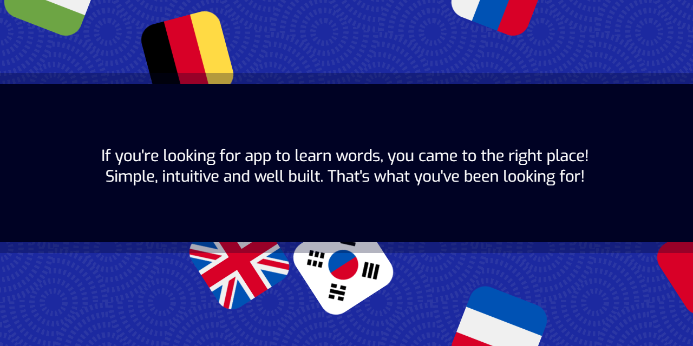

# Ingest App repository

## Navigation

- [Description](#description)
- [How To Use](#how-to-use)
- [References](#references)
- [License](#license)
- [Author Info](#author-info)

---

## Description

This application allows you to create sets of words in foreign languages, practise, and consequently be proud of yourself!
Main assumptions is to let user to entertain and ingest knowledge at the same time.
#### Technologies

- HTML5
- CSS3 
- JavaScript
- Python
- Django

[Back To The Top](#read-me-template)

---

## References
- [Streamlineicons](https://streamlineicons.com/)
- [Transparent textures](https://www.transparenttextures.com/patterns/swirl.png)
- [Flaticon](https://www.flaticon.com/)
---

## Authors Info

- Samuel Baron - [@samuelbaron](mailto:samuel.baron.pl@gmail.con)
- Jakub Stępkowski - [@stepkos](mailto:stepkos@wp.pl)

[Back To The Top](#read-me-template)
